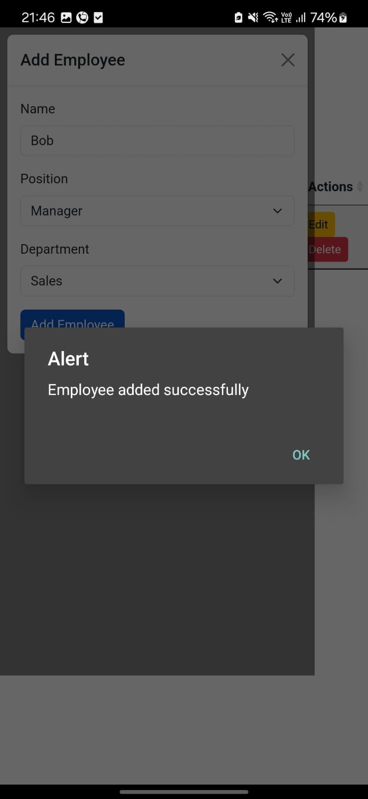
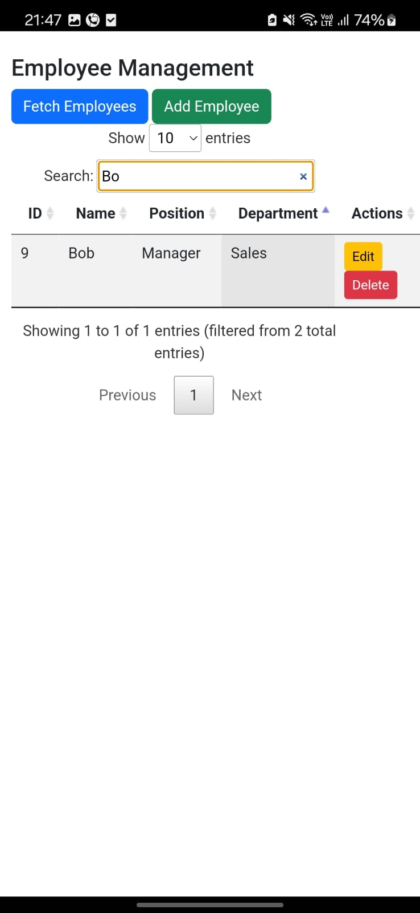
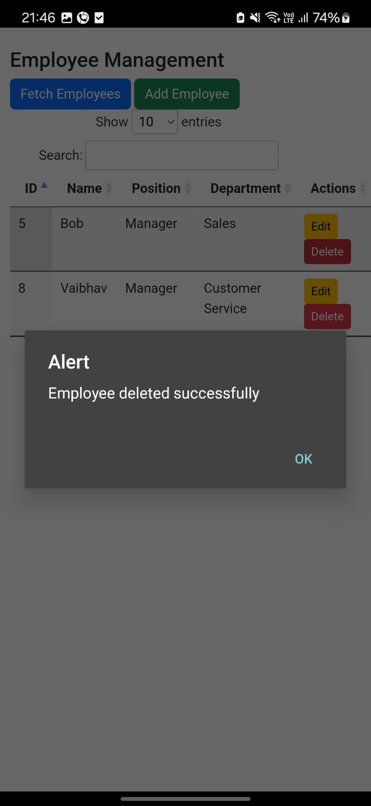
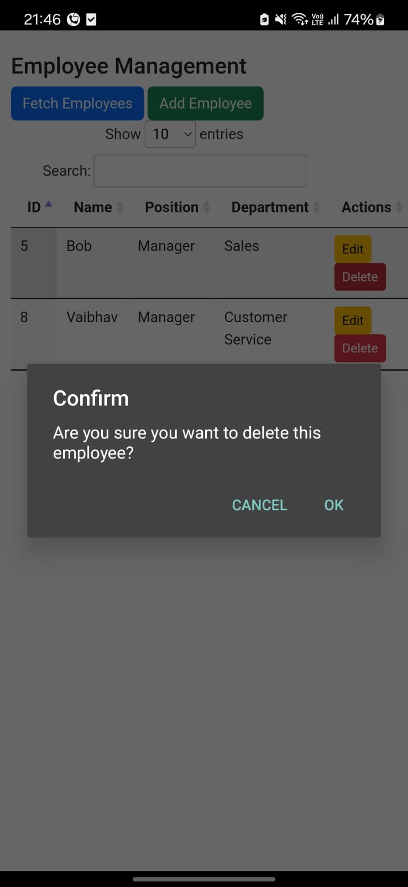
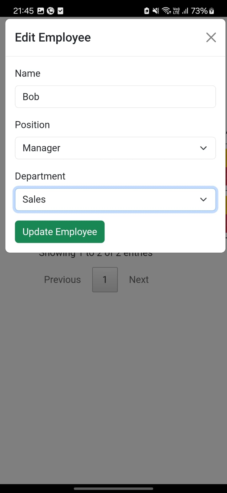
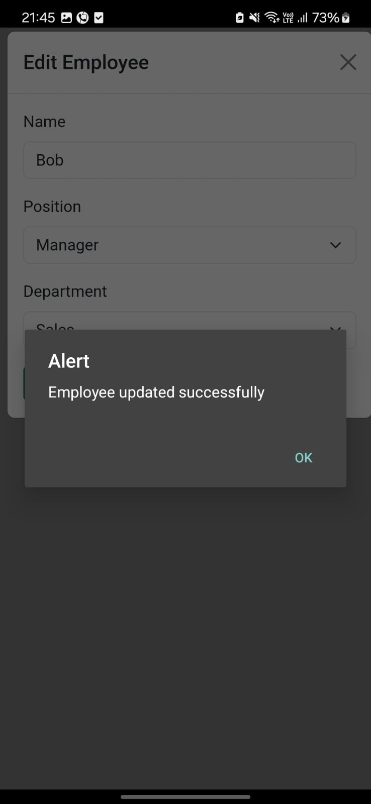
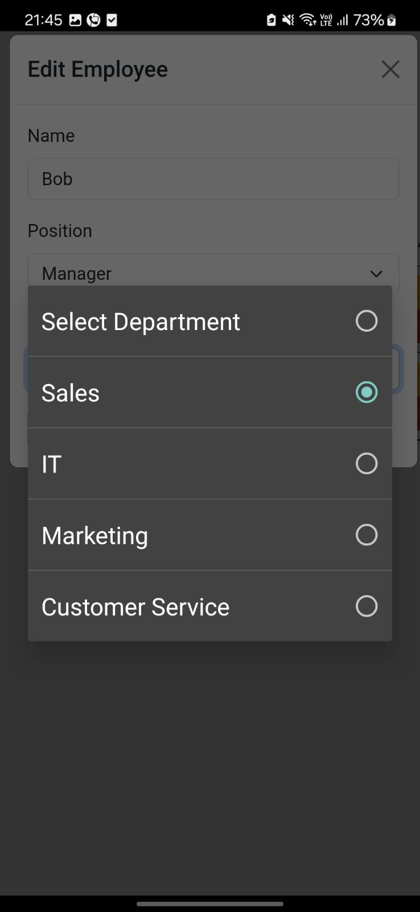
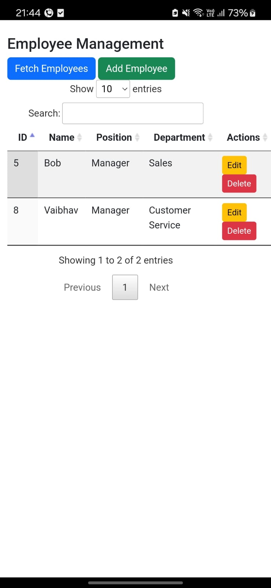
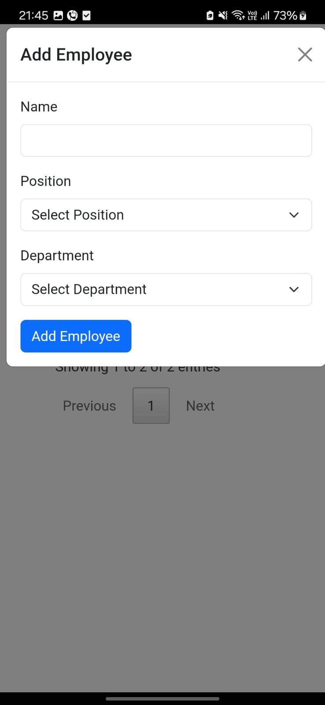

# Employee Management System (Cordova + PHP + MySQL)

## 📌 Overview

This is a mobile-friendly Employee Management System built using Apache Cordova for the frontend and PHP & MySQL for the backend. It allows users to view, add, edit, and delete employees with a smooth interface. The app uses DataTables for dynamic employee data rendering with server-side pagination, sorting, and filtering.

## 🚀 Features

- **Employee Dashboard:** Displays employees in a table with sorting, filtering, and pagination.
- **Employee Details Page:** View specific employee details.
- **Add/Edit Employee:** Form to create or modify employee records.
- **Delete Employee:** Remove employees from the database.
- **Dropdowns for Departments & Positions:** Select values dynamically fetched from the database.
- **API-Driven:** Uses RESTful APIs for communication between Cordova and the backend.
- **MySQL Database:** Employee data is stored and managed in a structured relational database.

## 🛠️ Technologies Used

### Frontend (Mobile App)

- Apache Cordova
- HTML, CSS, JavaScript
- jQuery & DataTables.js

### Backend (Server API)

- PHP
- MySQL Database

### Hosting

- Backend Hosted on InfinityFree
- Database on InfinityFree MySQL Server

## 📸 Screenshots

### 1. First Image:  


### 2. Second Image:  


### 3. Third Image:  


### 4. Fourth Image:  


### 5. Fifth Image:  


### 6. Sixth Image:  


### 7. Seventh Image:  


### 8. Eigth Image:  


### 9. Ninth Image:  


## ⚙️ Installation & Setup

### 1️⃣ Backend Setup (PHP & MySQL)

1. Upload the `backend/` folder to your InfinityFree FTP.
2. Import the `database.sql` file to your InfinityFree MySQL database.
3. Update `config.php` with your InfinityFree MySQL credentials.
4. Access the backend API at: `https://your-hostname.com/backend/employees.php`

### 2️⃣ Frontend Setup (Cordova)

1. Clone the repository:
    ```bash
    git clone https://github.com/your-username/EmployeeManagementSystem.git
    ```
2. Navigate to the project folder:
    ```bash
    cd EmployeeManagementSystem
    ```
3. Install Cordova dependencies:
    ```bash
    npm install
    cordova platform add android
    ```
4. Update `www/js/app.js` with your backend URL:
    ```javascript
    fetch("https://your-hostname.com/backend/employees.php")
    ```
5. Build the APK and run on Android:
    ```bash
    cordova build android
    cordova run android
    ```

## 📢 How to Use the App

1. Open the app and navigate to the Employee Dashboard.
2. Use the Add Employee form to create new employees.
3. Click on an employee to edit details or delete them if needed.
4. Dropdowns auto-populate from the database when adding or editing employees.

## 🤝 Contribution

Feel free to fork this repository and improve the system. Submit pull requests for enhancements or bug fixes.

## 📜 License

This project is open-source and free to use under the MIT License.

## 🔗 Contact

For any issues, reach out via [GitHub issues](https://github.com/your-username/EmployeeManagementSystem/issues) or email [your-email@example.com](mailto:your-email@example.com).
